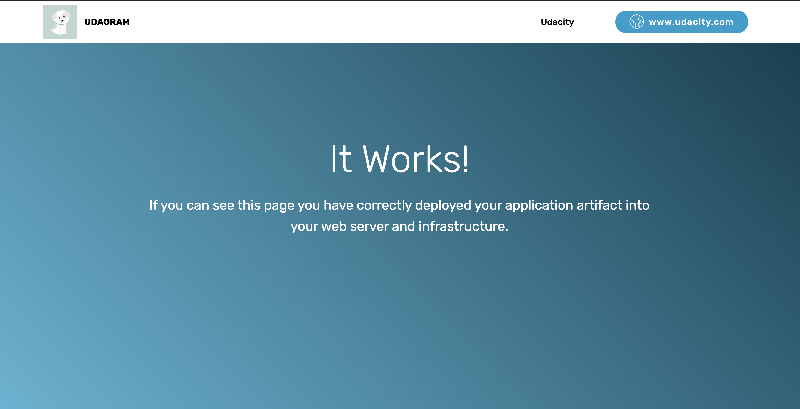

# Udagram

This template deploys a VPC, with a pair of public and private subnets. It deploys an internet gateway, with a default route on the public subnets. It deploys a NAT gateway and default routes for them in the private subnet. It is also creating Bastion instance with which we can ssh into private subnet instances using aws ssm.




Website Link - [Udagram](http://udagram-1268848586.ap-south-1.elb.amazonaws.com/)

## Creating Network Stack

For creating the network, run the `network.yaml` template with parameters file `network.json`

1. Create a network setup by running the below command.

    ```shell
    aws cloudformation create-stack --stack-name <stack_name> --parameters file://network.json --template-body file://network.yaml
    ```

2. Delete the stack by running the below command.

    ```shell
    aws cloudformation delete-stack --stack-name <stack_name>
    ```

## Creating Application Stack

For creating the sample website using Application Load Balancer attached to an Auto Scaling group and bastion host, run the `server.yaml` template with parameters file `server.json`

1. Create a server setup by running the below command.

    ```shell
    aws cloudformation create-stack --stack-name <stack_name> --parameters file://server.json --template-body file://server.yaml --capabilities CAPABILITY_IAM
    ```

2. Delete the stack by running the below command.

    ```shell
    aws cloudformation delete-stack --stack-name <stack_name>
    ```

### Components

* [x] VPC
* [x] 2 Public Subnets
* [x] 2 private Subnets
* [x] NAT Gateways
* [x] Internet Gatway
* [x] Route table for public and private subnet with asssociation.
* [x] ALB LoadBalancer
* [x] Launch Configuration
* [x] Autoscaling Group
* [x] Listerner added to ALB
* [x] Target Group
* [x] t2.medium instance (2 vCPU and 4 GiB of RAM) with 10GB EBS Volume

### Bonus Components

* [x] Bastion Instance for SSH
* [x] SSM Agent for ssh to private instances from Bastion instance.
* [x] Outputting Loadbalance endpoint with `http://`

> Why you defined t2.micro instance type rather than t3.small or better?

I thought we need to use 1 vCPU and 1 GiB of RAM and using T2 over T3 is because it is less costly. As T3.medium and T2.medium has same cost but T3 class has better performance over T2 so preferring T3.
